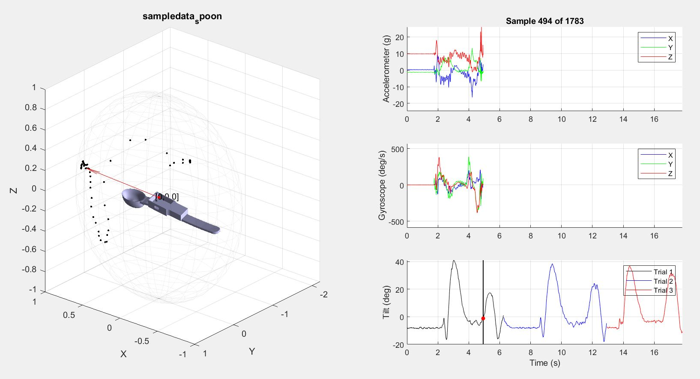
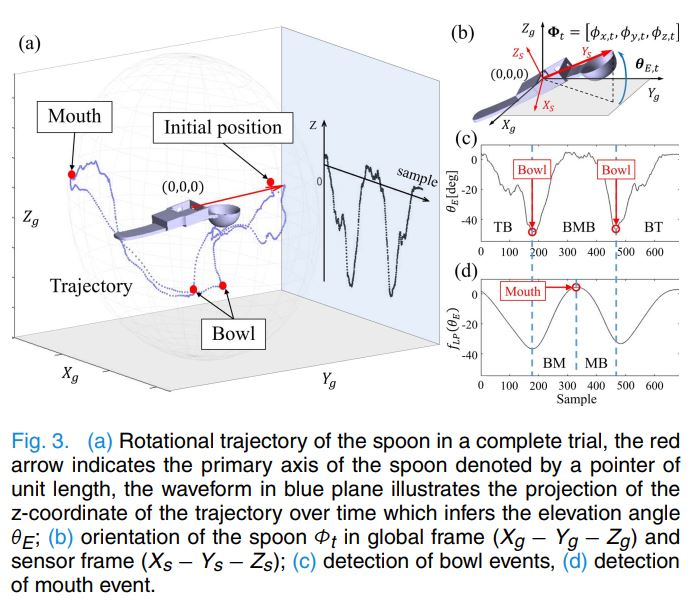

# SpoonAnimation 
A MATLAB script to simulate spoon movement from IMU data. 

# Publication 
Nguyen, K.D., Corben, L.A., Pathirana, P.N., Horne, M.K., Delatycki, M.B. and Szmulewicz, D.J., 2020. [The assessment of upper limb functionality in Friedreich ataxia via self-feeding activity.] (https://pubmed.ncbi.nlm.nih.gov/32142448/) IEEE Transactions on Neural Systems and Rehabilitation Engineering, 28(4), pp.924-933.

# Acknowledgements
[x-IO](http://x-io.co.uk/open-source-imu-and-ahrs-algorithms/) - Madwick and Mahony algorithms impementation, GNU GPL licensing.

